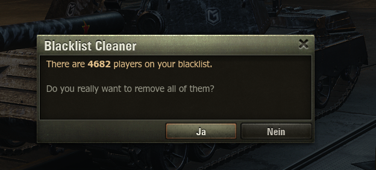
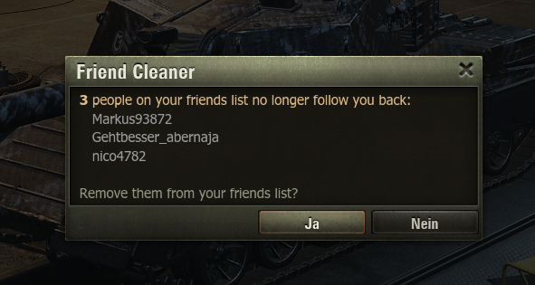
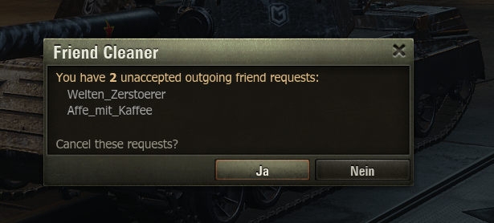

# Contact Cleaner

> A World of Tanks lobby mod for cleaning up your contacts — blacklist and friends list — straight from the hangar, with a confirmation dialog before anything is removed.

*Formerly known as **Blacklist Cleaner**.*

---

## Features

Three independent hotkeys, each guarded by a confirmation dialog so nothing is removed by accident.

### 🧹 Clear your blacklist — `ALT + F12`

Removes **every** player from your ignore list in one go. Handy after years of accumulated entries.

### 👋 Remove friends who no longer follow you back — `ALT + F10`

Lists everyone on your friends list who has dropped you (you still follow them, they no longer follow you), then removes them on confirmation. The affected names are shown in the dialog.

### ✖️ Cancel unaccepted friend requests — `ALT + F11`

Lists your own outgoing friend requests that are still pending and cancels them on confirmation.

---

## Installation

1. Download the mod and copy it into your World of Tanks **mods** folder for your current game version:
   `World_of_Tanks/mods/<version>/`
2. Start the game and load into your hangar.

> **Requires** the OldSkool `modsCore`. Without it the mod disables itself and prints a notice to `python.log`.

---

## Usage

Load into the hangar, then press the matching hotkey. A confirmation dialog appears — confirm to start, cancel to abort.

| Hotkey (Windows) | Hotkey (Mac) | Action |
| --- | --- | --- |
| `ALT + F12` | `Option + F12` | Clear the entire blacklist |
| `ALT + F10` | `Option + F10` | Remove friends who no longer follow you back |
| `ALT + F11` | `Option + F11` | Cancel your unaccepted outgoing friend requests |

On Mac, `Option` is the key next to `Command`.

### Notes

- Removal runs in the background — you can keep playing while contacts are being processed. Large blacklists take a while, since entries are removed one at a time with a short delay to stay within the game's rate limits.
- The mod only acts in the hangar; the hotkeys do nothing during a battle.
- Removed contacts are reported in `python.log`.

---

## Author

Made by **OldSkool** for the [IG-Oldskool](https://github.com/deadhat) community.

Issues and suggestions are welcome via the issue tracker.
