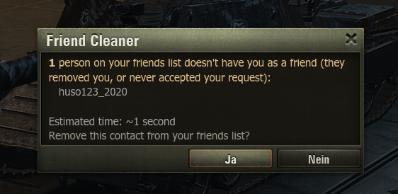

# Contact Cleaner

> A World of Tanks lobby mod for cleaning up your contacts — blacklist and friends list — straight from the hangar, with a confirmation dialog (including an estimated runtime) before anything is removed.

*Formerly known as **Blacklist Cleaner**.*

---

## Features

Two cleanup actions, each guarded by a confirmation dialog so nothing is removed by accident. Every dialog shows how many contacts are affected and roughly how long the cleanup will take.

### 🧹 Clear your blacklist — `ALT + F12`

Removes **every** player from your ignore list in one go. Handy after years of accumulated entries.

### 👋 Remove people who aren't your friends back — `ALT + F11`

Lists everyone on your friends list who doesn't have *you* as a friend — people who removed you, plus your own friend requests that were never accepted — and removes them on confirmation. Your real, two-way friends are never touched. Affected names are shown in the dialog (capped at 10, with a "+N more" note for large lists).

---

## Installation

1. Download the latest `contact_cleaner_*.zip`.
2. Extract it into your `World_of_Tanks/` folder — the archive already contains the correct folder structure, so the mod lands in the right place automatically.
3. Start the game and load into your hangar.

> **Requires** the OldSkool `modsCore`. Without it the mod disables itself and prints a notice to `python.log`.

---

## Usage

Load into the hangar, then press the matching hotkey. A confirmation dialog appears — confirm to start, cancel to abort.

| Hotkey (Windows) | Hotkey (Mac) | Action |
| --- | --- | --- |
| `ALT + F12` | `Option + F12` | Clear the entire blacklist |
| `ALT + F11` | `Option + F11` | Remove people who aren't your friends back |

On Mac, `Option` is the key next to `Command`.

### Notes

- Removal runs in the background — you can keep playing while contacts are being processed. Large lists take a while, since entries are removed one at a time with a short delay to stay within the game's rate limits. The dialog's estimated time reflects this.
- The mod only acts in the hangar; the hotkeys do nothing during a battle.
- Removed contacts are reported in `python.log`.

### Debug

Press `ALT + F9` in the hangar to dump every contact and its raw tags to `python.log`. Useful for troubleshooting or verifying what a cleanup would target before running it.
